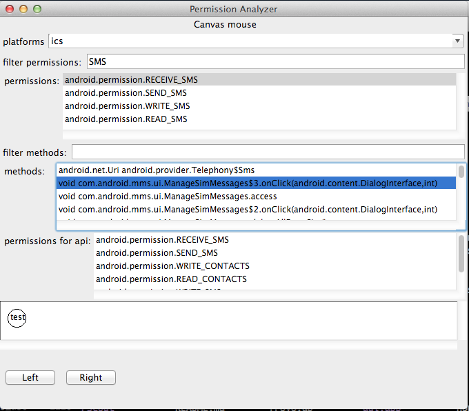

# GUI usage:
To run the GUI:
```
$ racket gui.rkt
```


# Command line usage
```
$ racket 
Welcome to Racket v5.3.
-> (require "permissions.rkt")
-> (current-platform)
(platform "Android 2.2.X" 8 "FROYO" #<permission-map>)
-> (lookup-api/re "sms")
'("boolean com.android.contacts.ContactsListActivity$ContactsSearchActivity.smsContact(android.database.Cursor)"
  "boolean com.android.contacts.SearchResultsActivity.smsContact(android.database.Cursor)"
    "boolean com.android.contacts.ContactsListActivity$JoinContactActivity.smsContact(android.database.Cursor)"
      "boolean com.android.contacts.ContactsListActivity.smsContact(android.database.Cursor)")
```

## Find permissions
```
-> (lookup-permission/re "bluetooth")
'("android.permission.BLUETOOTH_ADMIN" "android.permission.BLUETOOTH")
```

## Change platform
```
-> (current-platform)
(platform "Android 2.2.X" 8 "FROYO" #<permission-map>)
-> (current-platform 'ics)
-> (current-platform)
(platform
 "Android 4.0, 4.0.1, 4.0.2"
  14
   "ICE_CREAM_SANDWICH"
    #<permission-map>)
```
